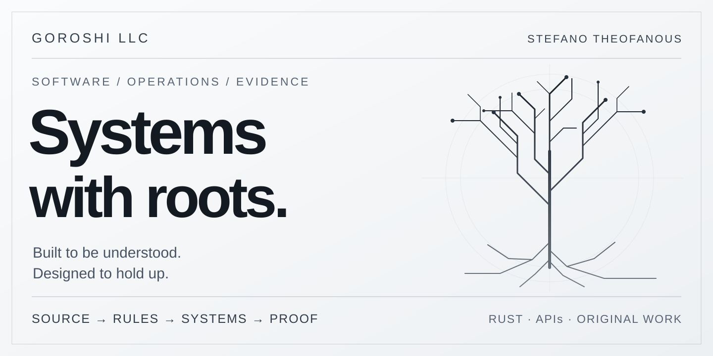

<picture>
  <source media="(prefers-color-scheme: dark)" srcset="assets/hero.svg">
  <source media="(prefers-color-scheme: light)" srcset="assets/hero-light.svg">
  
</picture>

Light/dark hero concept inspired by Jessica, who suggested adapting the artwork to the viewer's theme.

# Stefano Theofanous

**Founder, Goroshi LLC**

Software engineering · Business automation · AI developer tooling

**Systems with roots. Work with evidence.**

[Explore the work](#selected-work) · [How I build](#how-i-build) · [Public proof](#public-proof) · [Connect](#connect)

---

I build where software meets the work people actually have to do.
Restaurant operations, property workflows, developer tools, and geospatial screening all share a hard problem: turning scattered inputs into a result someone can explain and act on.
My focus is the connection between **source data**, **explicit business rules**, and **clear interfaces**.

**Rust** for typed boundaries and checked behavior.
**APIs** for systems that work together.
**AI-assisted development** with ownership, review, and evidence attached to the work.

### The working standard

**Research before implementation. Interfaces people can use. Evidence before completion.**

I study existing tools and primary documentation before choosing components.
I design for observable behavior, clear ownership, recovery, and reproducible checks.
The goal is software whose core operation does not depend on an AI agent being present.

## Selected work

| **01 / Business systems** | **02 / Developer platforms** |
| :--- | :--- |
| Restaurant and property workflows start with records from different sources. | AI-assisted work needs clear ownership and a reliable definition of completion. |
| **Engineering:** traceable inputs, exact allocation, typed money, and reviewable outputs. | **Engineering:** isolated workspaces, bounded context, explicit task ownership, and evidence tied to each claim. |

| **03 / Geospatial decisions** | **04 / Observable state** |
| :--- | :--- |
| A nearby map feature can appear more certain than its source permits. | Useful analysis starts with a clear account of what the system observed. |
| **Engineering:** provenance, exclusions, and visible unknowns in energy-site screening. | **Public example:** local JSON snapshots from the RuneLite plugin linked below. |

<strong>What these terms mean</strong>

**Typed money** means amounts are represented as integer cents with operations designed to preserve accounting invariants.
**Provenance** means a conclusion retains a path back to the source and method that produced it.
**Evidence of completion** separates source review and tests from integration, installation, and observed behavior.

These are architectural descriptions of private work at different stages.
They are not claims that every component is public, deployed, or available to run.

## Public proof

### Local Data Exporter

**RuneLite plugin · Local JSON snapshots · Personal tracking and analysis**

The [public repository](https://github.com/goroshillc/local-data-exporter) documents a plugin that writes local account snapshots to JSON.
It makes state inspectable while keeping the resulting account data local.

| Boundary | Decision |
| :--- | :--- |
| **Capture** | Export structured account snapshots. |
| **Inspect** | Document the exported data and files. |
| **Privacy** | Keep personal account output local. |

**[Inspect the source and documentation →](https://github.com/goroshillc/local-data-exporter)**

### This profile, reproducible

The [profile repository](https://github.com/goroshillc/goroshillc) contains this page and its original artwork.
Its publication check rejects local paths, private network addresses, external image hosts, and active SVG content before changes land.
The visual is repository-owned SVG, with no remote statistics widget or tracking image dependency.

**[Read the publication guard](https://github.com/goroshillc/goroshillc/blob/main/tools/profile_guard.rs)** · **[See the checks](https://github.com/goroshillc/goroshillc/actions)**

## How I build

| Step | The question that matters |
| :--- | :--- |
| **01 / Source** | What was actually observed, and where did it come from? |
| **02 / Invariant** | What must remain true, including when input is bad? |
| **03 / System** | Where do ownership, types, and interfaces enforce that rule? |
| **04 / Verification** | Do failure cases fail clearly, and can the result be reproduced? |
| **05 / Acceptance** | Does the behavior people actually see match the claim? |

I prefer explicit failure to a result that only looks complete.
I keep a distinction between an idea, a source change, a passing test, and a working product.
For operational and financial work, uncertainty stays visible until the evidence resolves it.

<strong>Engineering boundaries I care about</strong>

- **Correctness:** checked arithmetic, validated input, and errors that identify a failed boundary.
- **Privacy:** public explanations do not expose private records, credentials, internal endpoints, or unreleased implementation details.
- **Reviewability:** small changes, clear ownership, reproducible checks, and honest acceptance limits.
- **Usability:** the interface should help someone understand the next decision without knowing the entire system first.

## Connect

### Build something that holds up.

I am open to **fully remote** software roles involving backend systems, business automation, internal tools, and applied AI.

**[Connect on LinkedIn →](https://www.linkedin.com/in/stefano-theofanous-a418a4426/)**

I can discuss the architecture and engineering decisions behind private work without exposing customer, family, or business records.

---

© 2026 Goroshi LLC. All rights reserved. Public overview only.

By the grace of God, I give all glory to Jesus Christ.
