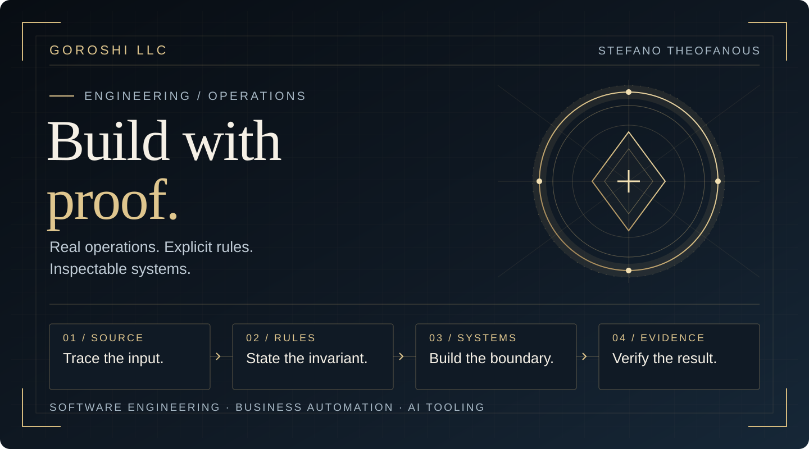

<div align="center">



# Stefano Theofanous

**Founder, Goroshi LLC** · Software engineering · Business automation · AI developer tooling


[The work](#selected-work) · [Inspect the proof](#public-proof) · [Engineering method](#how-i-build) · [Connect](#connect)

</div>

I build software for operational work where the **source**, the **rule**, and the **result** all need to be understood.
My projects span restaurant and property workflows, document processing, and tools for accountable AI-assisted development.
I use Rust for new systems and distinguish source code, passing tests, integration, and observed behavior.

## Selected work

| Area | Real problem | Engineering response |
| :--- | :--- | :--- |
| **Operational software** | Sales, receipts, property records, and labor workflows | Traceable inputs, exact accounting, and outputs a person can review. |
| **Developer platforms** | AI-assisted engineering with shared repositories and agents | Bounded ownership, reproducible checks, and evidence that integration worked. |
| **Data and decisions** | OCR, geospatial screening, and local game telemetry | Provenance, freshness, explicit uncertainty, and a clear next action. |

These are architectural descriptions of private work at different stages, not claims that every component is public, deployed, or available to run.
Customer records, family information, and internal systems stay private.

## Public proof

**This profile is a working example.**
The [repository](https://github.com/goroshillc/goroshillc) includes original, locally hosted vector artwork, a [Rust publication guard](tools/profile_guard.rs), and a [GitHub Actions check](.github/workflows/profile-guard.yml).
The guard rejects selected private paths and network addresses, remote image hosts, and active SVG content.
Read the code and its tests to see exactly what it checks.
It is a bounded check, not a claim that any scanner catches every possible leak.

**[Local Data Exporter](https://github.com/goroshillc/local-data-exporter)** is a maintenance fork of [GoblinTek's BSD-2-Clause project](https://github.com/GoblinTek/local-data-exporter).
It writes local account and gameplay snapshots to JSON; the exported account data remains local to the user.
I identify the fork's origin because maintenance and original architecture are different accomplishments.
I am also developing a separate first-party exporter.
Its source is private and its client integration is not yet verified, so I do not present it as a finished public product.

**A five-minute review path:** inspect this README, open the publication guard, read its failure-case tests, then check the Actions result for the commit you are reviewing.
That path shows what is public and verifiable without asking you to trust an activity graph, a vanity metric, or private repository claims.

## How I build

```text
Understand the actual source
    ↓
State the invariant and failure modes
    ↓
Build a small, owned implementation path
    ↓
Test both valid and bad inputs
    ↓
Check the integrated behavior people see
```

I prefer typed values, explicit errors, small reviewable changes, and a record of what was verified.
For money, that means integer-cent arithmetic and reconciled source records.
For AI-assisted work, it means giving an agent a bounded task, preserving its output, and independently checking the result.
For a public claim, it means distinguishing source, test, deployment, and observed behavior.

<details>
<summary><strong>Engineering principles in more detail</strong></summary>

- **Correctness:** model important constraints in types; reject malformed input; test the failure path.
- **Provenance:** keep a result tied to its source and method so it can be checked later.
- **Ownership:** assign one editor to a file or component at a time; make handoffs explicit.
- **Security:** publish curated explanations and original code without exposing private operational data.
- **Usability:** make the next action understandable without requiring the user to know the entire system.

</details>

## Connect

I am interested in **fully remote** software engineering roles involving backend systems, business automation, internal tools, or applied AI.
[Connect with me on LinkedIn](https://www.linkedin.com/in/stefano-theofanous-a418a4426/).
I can discuss the design and tradeoffs behind private work while keeping the underlying records private.

---

<sub>© 2026 Goroshi LLC. Public overview and original artwork.</sub>
<sub>By the grace of God, I give all glory to Jesus Christ. Non nobis Domine.</sub>
